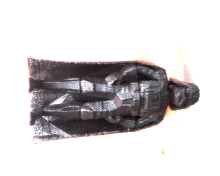

# Procesamiento-de-Campos-de-Luz

Este repositorio contiene el código fuente para los algoritmos enunciados a continuación, desarrollados en la asignatura de enfásis "Procesamiento de Imágenes y Video" en el programa de Ingeniería Electrónica de la Pontificia Universidad Javeriana. ***Autores: Juan Felipe Jaramillo Hernández, María Fernanda Hernández Baena, Valeria Méndez Sarmiento.***

Se implementaron los siguientes algoritmos para el post-procesamiento de un campo de luz capturado; Se implementa un algoritmo para extraer las [imágenes de sub-apertura](Extraccion_imgs_sub_apertura/obtencion_imgs_subapertura_final.py) de un campo de luz capturado con una cámara plenóptica afocal, una vez se obtienen las imágenes de sub-apertura, se implementa un algoritmo computacional para [sub-muestrear](Sub_muestreo/decimacion_espacial.py) espacial y angularmente el campo de luz, además, se implementa otro algoritmo para organizar el campo de luz en una [secuencia sin discontinuidades](Secuencia_sin_discontinuidades/ssd_puntos_ping_pong_Multiprocessing.py) utilizando el flujo óptico. El video y el artículo se pueden encontrar acá:

Video: <>
Artículo: <>

Tabla de Contenidos
=================

<!--ts-->
* [Procesamiento de Campos de Luz](#Procesamiento-de-Campos-de-Luz)
* [Tabla de Contenidos](#tabla-de-contenidos)
* [Resultados Obtenidos](#Resultados-Obtenidos)
* [Extracción de imágenes de sub-apertura](#Extraccion-de-imagenes-de-sub-apertura)
* [Secuencia-sin-discontinuidades](#Secuencia-sin-discontinuidades)
* [Sub-muestreo espacial y angular](#Sub-muestreo-espacial-y-angular)
* [Referencias](#Referencias)
<!--te-->

### Resultados Obtenidos
A partir del siguiente campo de luz (capturado por una cámara plenóptica afocal de alta resolución) se logró extraer la vista central de todos los micro-lentes. El sensor de imagen consta de 220 x 176 micro-lentes, y una pequeña porción del campo de luz se puede observar a continuación:

**Campo de luz capturado (*Imagen propia*)**

**Vista central del campo de luz capturado (*Imagen propia*)**

Ya que la imagen anterior tiene una resolución pequeña (de acuerdo a la matriz de micro-lentes de la cámara plenóptica), se realiza una interpolación bicúbica sobre el resultado anterior:

Los resultados obtenidos anteriormente no fueron los esperados, debido a la estructura de la malla de micro-lentes y la tecnología de la cámara plenóptica con la que se capturó. Por esta razón, los siguientes resultados se obtuvieron de un campo de luz tomado del [Conjunto de datos de Campos de Luz de Stanford](http://lightfield.stanford.edu/lfs.html).

A continuación, se muestra la secuencia sin discontinuidades obtenida después de implementar una organización de acuerdo al flujo óptico en las dimensiones X y Y entre las imágenes de sub-apertura del campo de luz.

## Extracción de imágenes de sub-apertura

## Secuencia sin discontinuidades

## Sub-muestreo espacial y angular

### Referencias

[1] Conjunto de datos de Campos de Luz, Universidad de Stanford. Disponible en http://lightfield.stanford.edu/lfs.html